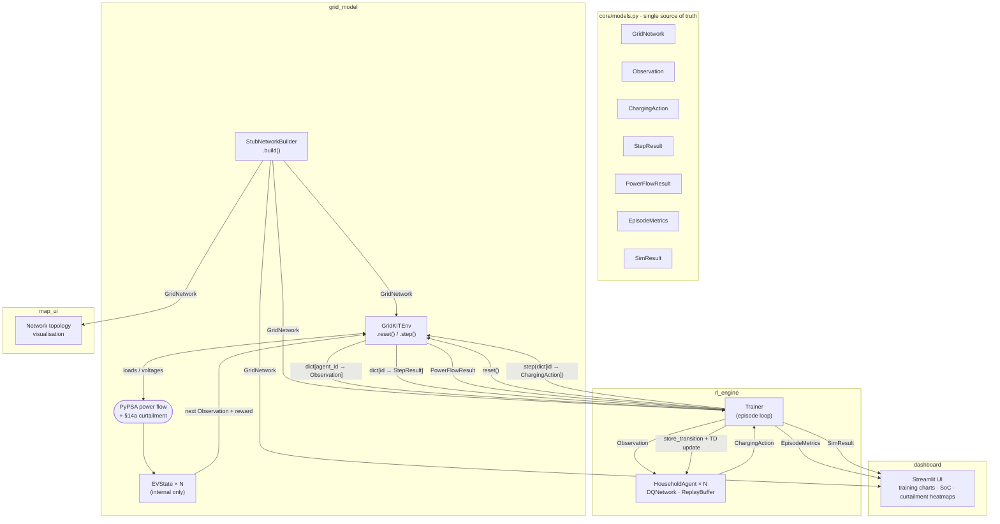

# GridKIT — Module Architecture

> How grid_model, rl_engine, map_ui, and dashboard communicate through core models. Last updated: May 2026.

---

---

## Core model ownership

| Model | Produced by | Consumed by | When |
|---|---|---|---|
| `GridNetwork` | grid_model (builder) | grid_model, rl_engine, dashboard, map_ui | setup — once per run |
| `Observation` | grid_model | rl_engine | every timestep, per agent |
| `ChargingAction` | rl_engine | grid_model | every timestep, per agent |
| `StepResult` | grid_model | rl_engine | every timestep, per agent |
| `PowerFlowResult` | grid_model | rl_engine → SimResult | every timestep, shared |
| `EpisodeMetrics` | rl_engine | dashboard | episode end |
| `SimResult` | rl_engine | dashboard | episode end |
| `EVState` | grid_model | grid_model only | internal — never crosses module boundary |

---

## Key design rule

Modules communicate **only through `core/models.py`**. No module imports from another module directly.
`grid_model` implements `GridEnvProtocol`; `rl_engine` depends only on that protocol interface, never on the concrete implementation.
