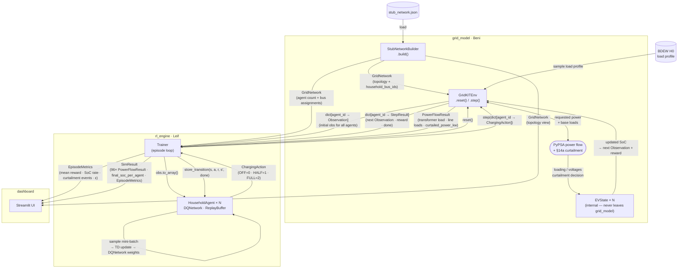

# GridKIT — Data Flow Diagram (DQN approach)

> Phase 1 · Independent DQN agents · Discrete action space (OFF / HALF / FULL). Last updated: May 2026.

---

---

## Reading the diagram

**Setup (once per run)**
`StubNetworkBuilder` loads `stub_network.json` and produces a `GridNetwork`. This is distributed to all three consumers: `GridKITEnv` uses it to build the internal PyPSA network; `Trainer` reads `household_bus_ids` to instantiate one `HouseholdAgent` per household (filtered by `ev_penetration`); the dashboard receives it for topology visualization.

**Episode reset**
`Trainer` calls `env.reset()`. The environment samples a new scenario from the configured distributions (arrival time, initial SoC, departure time) and draws a BDEW H0 load profile scaled by a random `load_multiplier`. It returns one `Observation` per agent as the starting state.

**Timestep loop (×96)**
Each of the 96 fifteen-minute steps follows the same sequence:
1. `Trainer` passes each agent's current observation — `HouseholdAgent` picks a `ChargingAction` (ε-greedy over DQN Q-values).
2. `Trainer` calls `env.step(actions)`.
3. Inside `step()`: PyPSA runs the full power flow over the network; if the transformer or any line exceeds 1.0 p.u. loading, §14a curtailment is applied; each EV's SoC is updated with the actual (possibly curtailed) power; rewards and next observations are computed.
4. `env.step()` returns a `StepResult` per agent and one shared `PowerFlowResult` for the timestep.
5. Each agent stores the transition `(s, a, r, s', done)` in its `ReplayBuffer` and runs a TD update.

**Episode end**
`Trainer` assembles `EpisodeMetrics` (aggregated stats) and `SimResult` (the full per-timestep record) and hands both to the dashboard.

---

## Key data models in the flow

| Model | From | To | What it carries |
|---|---|---|---|
| `GridNetwork` | grid_model (builder) | grid_model, rl_engine, dashboard | topology + residential bus list |
| `Observation` | grid_model | rl_engine | 5-dim agent input vector |
| `ChargingAction` | rl_engine | grid_model | discrete charging decision (0/1/2) |
| `StepResult` | grid_model | rl_engine | next obs · reward · done flag |
| `PowerFlowResult` | grid_model | rl_engine (→ SimResult) | network loading + curtailment per timestep |
| `EpisodeMetrics` | rl_engine | dashboard | aggregated episode stats |
| `SimResult` | rl_engine | dashboard | full episode record for visualisation |
